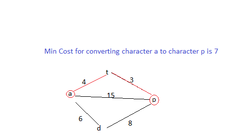

# v-hack-Round1

## Solution Explantion (Logic)
<br>

> Main logic behind the solution to convert string into palindrome with minimum cost is that we are calculating the minimum cost for converting one character to respective another character to make a palindromic string.

<br>

>We are creating an 2d array of 26x26 dimentions that represents the minimum distance of indivisual character to every other character and minimum cost is calculated through Floyd Warshall Algorithm. For example - So if we need to convert a->t then using Floyd warshall we will store the minimum cost to convert a->t through all other characters.

<br>

>Then, we iterate through string S of length L from i=0 to i=L/2, for each s[i] character we find which path provides the minimum cost to reach s[L-i-1] and vice-versa for equality of s[i] and s[L-i-1] to generate a palindromic string.

<br>
<br>



## Function Explantion - 
<br>

### main() Function

```
1 Firstly we are taking user input.
2 Then we have created 2d array "costDis" of size 26x26.
3 Initailize the array with infinity and all the diagonal values with zero. Because the distance from a->a is zero.
4 Then for conversion i->j with cost w in 2d array set costDis[i][j] = w and costDis[j][i]=w.
5 Then apply the Floyd warshall algorithm to find the minimum cost from every i->j through k(i.e every character). So
costDis[i][j] = min(costDis[i][k]+costDis[k][j],costDis[i][j])
6 Then call the function "findMinimumCost".
```
<br>

### findMinimumCost(long[][] costDis, String palindromeString, long infinity) Function

```
1 We have "palindromeString" with length "stringSize" then we iterate from i=0 to i=(stringSize/2).
2 Then palindromeString[i] is ith character from front and palindromeString[stringSize-i-1] is ith character from last.
3 If front and last character are not matching then we need to find the cost to convert one character to another i.e palindromeString[i]-> palindromeString[stringSize-i-1] or vice versa.
4 Then using the "costDis" array we will find the minimum conversion cost for each character of string S.
5 Then sum up the cost for each character and then at the end return it from function findMinimumCost.

```

<br>

## Test Cases

### Sample Test Case 1:

```
   Input:  
    veersa
    4
    r e 40
    s e 30
    a t 50
    t v 81

   Output:  
   	201
```

### Sample Test Case 2:

```
   Input:  
   	mat  
   	2  
   	m t 15  
   	a m 7 

   Output:  
   	15  
```

### Sample Test Case 3:

```
   Input:  
   	mam  
   	2  
   	m t 15  
   	a m 7 

   Output:  
   	0
```

### Sample Test Case 4:

```
   Input:  
   	matz
    5
    m z 1000
    m p 50
    t p 30
    z t 400
    p a 100

   Output:  
   	610
```

### Sample Test Case 5:

```
   Input:  
   	a
    2
    a t 0
    t m 2

   Output:  
   	0
```

### Sample Test Case 6:

```
   Input:  
   	aaaaat
    3
    a t 5
    a p 1
    p t 2

   Output:  
   	3
```

### Sample Test Case 7:

```
   Input:  
   	palihdromeamqrdnitap
    8
    l q 630
    q o 10000
    t o 509
    e o 80
    o a 71
    n x 63
    x h 909
    o l 400

   Output:  
   	3062
```

### Sample Test Case 8:

```
   Input:  
   	popoy
    6
    p a 910
    a m 67
    p t 610
    t y 42
    m y 1000
    u y 500

   Output:  
   	652
```